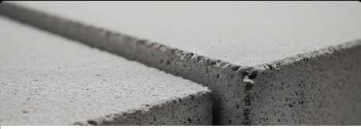

# Concrete_Strength_prediction

---
The model predicts the compressive strength (MPa) of concrete based on ingredients like cement, water, slag, and age.  I trained a ReLU-based neural network, saved the model in PyTorch, and deployed it in a Streamlit app so users can input mix values and instantly get predictions.  This project helped me understand model training, saving in PyTorch

---

***🧱 Concrete Strength Prediction using PyTorch + Streamlit***
---
This project is a machine learning web application built with Streamlit that predicts the compressive strength of concrete (in MPa) based on its mix composition.
It uses a trained PyTorch regression model with ReLU activation to estimate strength given input features like cement, water, fly ash, aggregates, and age.

***📘 Table of Contents***
---
Overview

Model Architecture

Tech Stack

App Features

Installation & Setup

Usage

Input Features

Model Details

Example Prediction

Deployment

Future Improvements

Author

***🧩 Overview***
---

Concrete strength is a critical property that determines the quality and durability of structures.
Instead of waiting days for lab test results, this app provides instant predictions using a trained neural network model.

The model learns the complex nonlinear relationships between the concrete’s ingredients and its resulting compressive strength.

***🧠 Model Architecture***
---
The regression model is a deep feedforward neural network (MLP) with the following architecture:

Layer	Type	Output Size	Activation
Input	Linear	8	—
Hidden 1	Linear	32	ReLU
Hidden 2	Linear	16	ReLU
Output	Linear	1	—

Loss Function: Mean Squared Error (MSE)
Optimizer: Adam
Framework: PyTorch

***⚙️ Tech Stack***
---
Category	Tools
Language	Python
Web Framework	Streamlit
ML Framework	PyTorch
Data Handling	Pandas, NumPy
Preprocessing	StandardScaler (sklearn)
Visualization	Streamlit UI elements

***🌟 App Features***
---

✅ Interactive Streamlit interface
✅ Real-time concrete strength prediction
✅ Model built and loaded using PyTorch
✅ Scalable and lightweight
✅ Easy deployment on Streamlit Cloud

***💻 Usage***
---
Launch the app.

Enter values for each concrete ingredient (cement, slag, fly ash, water, etc.).

Click “🔮 Predict Strength”.

View the predicted compressive strength in MPa.

***📊 Input Features***
---
Feature	Description	Example
Cement	Cement content (kg/m³)	300
Blast Furnace Slag	Slag content (kg/m³)	70
Fly Ash	Fly ash content (kg/m³)	50
Water	Water content (kg/m³)	180
Superplasticizer	Chemical additive (kg/m³)	6
Coarse Aggregate	Gravel/stones (kg/m³)	970
Fine Aggregate	Sand (kg/m³)	770
Age	Concrete age (days)	28

***🧠 Model Details***
---
Model: DeeperConcreteMLP

Framework: PyTorch

Activation: ReLU

Optimizer: Adam

Loss Function: MSELoss

File: concrete_strength_model.pth

***🏗️ Concrete Strength Prediction App***
---
This Streamlit web app predicts the compressive strength of concrete based on its ingredient proportions using a PyTorch regression model.

The model was trained on a dataset containing various concrete mix components and their corresponding strength, helping civil engineers and researchers estimate concrete quality before real-world testing.

***📋 Project Overview***
---
Concrete strength depends on several key factors like the amount of cement, water, coarse aggregate, fine aggregate, fly ash, and age of the concrete.
This app allows users to input these parameters and instantly get a predicted compressive strength (MPa) value.

The model uses deep learning (PyTorch) to learn nonlinear relationships between the mix components and the resulting strength.

***🚀 Features***
---
✅ User-friendly Streamlit interface
✅ Real-time strength prediction based on user input
✅ Data visualization for model insights
✅ Trained PyTorch regression model integrated into the app
✅ Lightweight and cloud-deployable

URL_link : https://concretestrengthprediction-6xbpvzizf6mr8lmt94agic.streamlit.app/

